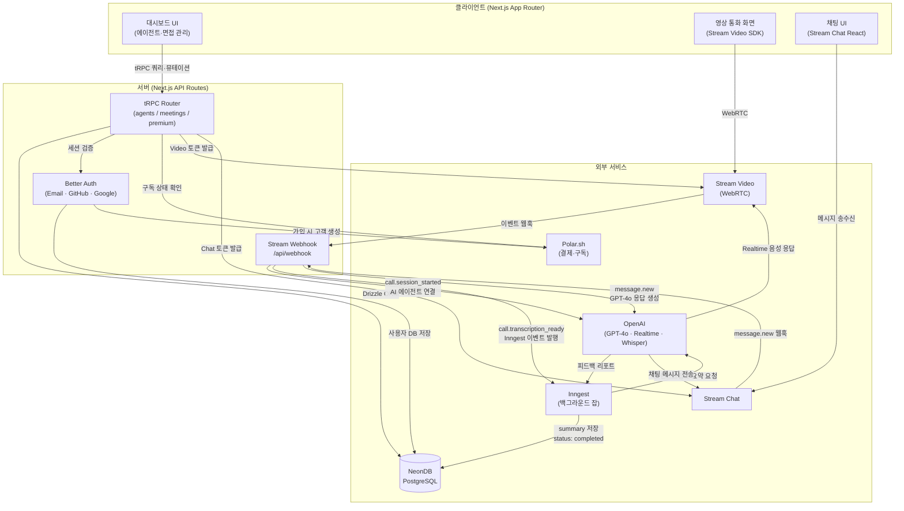
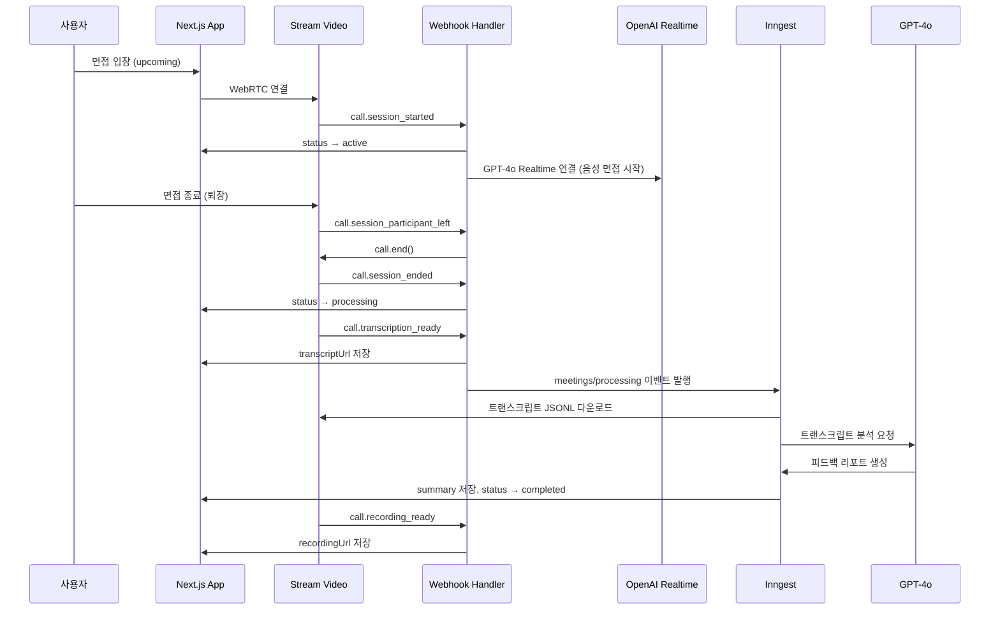

# SYNCNOTE

> AI 면접관과 실시간 음성 면접을 진행하고 피드백을 받는 서비스

<br />

[](https://nextjs.org/)
[](https://www.typescriptlang.org/)
[](https://tailwindcss.com/)
[](https://vitest.dev/)
[](https://www.cypress.io/)

🔗 **서비스 배포 링크:** https://syncnotee.vercel.app  
🔑 **테스트 계정:** `test@google.com` / `test1234!`  

> [!NOTE]
> 테스트 계정으로 로그인하시면, 번거로운 가입 및 면접 진행 절차 없이 **완성된 AI 피드백 리포트 샘플**을 즉시 확인하실 수 있습니다.

---

## 목차

<details open>
  <summary>📑 목차 보기</summary>
  <div markdown="1">
    
  - [프로젝트 기획 배경](#프로젝트-기획-배경)
  - [프로젝트 핵심 주도 영역](#프로젝트-핵심-주도-영역)
  - [프로젝트 정보](#프로젝트-정보)
  - [주요 기능](#주요-기능)
  - [기술 스택](#기술-스택)
  - [시스템 아키텍처](#시스템-아키텍처)
  - [면접 상태 흐름](#면접-상태-흐름)
  - [트러블 슈팅](#트러블-슈팅)
  - [테스트 전략](#테스트-전략)
  - [회고](#회고)
  - [프로젝트 구조](#프로젝트-구조)
  - [로컬 실행](#로컬-실행)

</div>
</details>

## 프로젝트 기획 배경

이직을 준비하며 CS 면접 스터디를 직접 운영했습니다. 매주 과목별 예상 질문을 공유하고, 스터디 당일에는 무작위로 질문을 뽑아 발표와 피드백을 주고받는 방식이었는데, 시행착오 끝에 느낀 가장 큰 변수는 **사람**이었습니다. 스터디원이 갑자기 불참하면 발표 기회 자체가 사라지고, 결국 스터디가 흐지부지 끝나는 일이 반복되었습니다.

이런 경험을 하면서

> _"혼자서도 충분히 효과적으로 면접 연습을 할 수 있는 방법이 있지 않을까?"_

라는 고민이 떠올랐습니다.

실전 면접에서 느끼는 긴장감이나 말하기 연습은 텍스트 기반 AI 챗봇만으로는 대체하기 어려웠습니다. 이러한 문제의식을 바탕으로, **음성으로 AI와 실시간 면접을 진행**하고 종료 후에는 **전문적인 피드백**까지 받을 수 있는 서비스를 기획했습니다.

## 프로젝트 핵심 주도 영역

초기 뼈대는 강의를 참고했으나, 실서비스 환경을 염두에 두고 아래 세 가지 영역을 직접 설계하고 고도화하는 데 주력했습니다.

- **안정적인 비동기 이벤트 파이프라인 구축:** 사용자 경험을 해치지 않기 위해, 무거운 AI 분석 로직을 동기 처리에서 웹훅 기반의 비동기 이벤트 환경으로 분리하고 서버리스 환경에 맞게 최적화했습니다.
- **면접 도메인에 최적화된 AI 인터랙션:** 일상 대화용으로 맞춰진 기본 AI 음성 모델을 '면접'이라는 특수한 상황에 맞게 튜닝하여, 실제 면접관과 대화하는 듯한 자연스러운 오디오 UX를 구현했습니다.
- **실서비스 레벨의 자동화 테스트 환경:** 안정성 검증을 위해 강의에는 없던 Vitest와 Cypress를 도입하고, GitHub Actions를 통한 CI 파이프라인을 직접 구축했습니다.

## 프로젝트 정보

| 구분 | 내용 |
| --- | --- |
| **기간** | 2026.02 ~ 진행 중 |
| **형태** | 1인 프로젝트 |
| **비고** | Next.js 15 보안 취약점 인지 후 Next.js 16 및 최신 라이브러리로 전체 마이그레이션 |

## 주요 기능

| AI 면접관 커스터마이징 |
| :---: |
| 직무, 기술 스택, 난이도, 면접 스타일 설정 |
|  |

| 실시간 음성 면접 |
| :---: |
| WebRTC 기반 음성 통신 + AI 실시간 응답 (GPT-4o Realtime) |
| <video src="https://github.com/user-attachments/assets/35a1df48-c0b8-481a-9703-d2eab57de16c" width="300" controls></video> |

| AI 피드백 리포트 | 
| :---: |
| 면접 종료 후 대화 기록을 백그라운드에서 분석해 총평·강점·개선점 등 제공 |
|  |

| 면접 후 AI 채팅 |
| :---: |
| 면접 내용을 컨텍스트로 활용한 추가 피드백 대화 |
|  |

## 기술 스택

강의에서 사용된 스택을 기반으로 하되, 각 기술이 왜 이 조합으로 쓰이는지 짚어보며 따라갔습니다.  
특히 테스트 도구인 Vitest와 Cypress는 실무적인 필요를 고려하여 직접 선정했습니다.

| 분류 | 기술 | 도입 목적 및 활용 |
| --- | --- | --- |
| Framework | Next.js 16, React 19 | RSC를 활용해 초기 데이터를 프리페칭하고, API와 UI를 단일 레포에서 통합 관리 |
| API | tRPC v11, TanStack Query | 별도 API 스펙 정의 없이 서버·클라이언트 간 타입 안정성 확보 및 인증/구독 상태 미들웨어 분리 |
| Database | PostgreSQL (NeonDB), Drizzle ORM | 서버리스·엣지 환경에서 콜드 스타트 시 연결 속도를 높이기 위해 Prisma보다 가벼운 Drizzle 도입 |
| Auth | Better Auth | 이메일·비밀번호 인증과 OAuth(GitHub·Google)를 단일 라이브러리로 통합하여 인증 흐름 단순화 |
| Video / Chat | Stream Video SDK, Stream Chat | 복잡한 WebRTC 인프라를 직접 구축하는 대신, 녹화·트랜스크립션·웹훅 파이프라인 등 핵심 비즈니스 로직에 집중하기 위해 도입 |
| AI / LLM | GPT-4o, GPT-4o Realtime, Whisper | Realtime API의 Server VAD로 실시간 음성 턴 감지 최적화, Whisper로 한국어 트랜스크립션 처리 |
| Background Jobs | Inngest | 무거운 트랜스크립트 분석 로직을 웹훅 이후 별도 워크플로우로 분리하여 API 응답 속도를 보장하고 재시도 가능한 안정적인 작업 구조 구성|
| Styling | Tailwind CSS v4, shadcn/ui | 접근성이 보장된 headless 컴포넌트에 유틸리티 클래스를 적용하여 빠르고 일관된 UI 개발 |
| Testing | Vitest, Cypress | 비즈니스 로직과 UI 컴포넌트, 핵심 사용자 시나리오의 레이어를 분리하여 CI 자동화 구축 |

## 시스템 아키텍처



## 면접 상태 흐름



## 트러블 슈팅

### 1. 서버리스 환경에서 AI 채팅 응답이 중복 전송되는 문제

- **문제:** Ask AI 채팅에서 메시지를 보내면 AI가 동일한 답변을 여러 번 전송
- **원인:**
  - 서버리스 환경에서 API가 `return NextResponse.json()`으로 응답을 즉시 반환하면, 함수 실행이 곧바로 종료
  - 이로 인해 실제 AI 응답 완료 전에 함수가 종료되면서 Stream Chat에서는 응답 실패로 판단해 웹훅을 계속 재시도함

```ts
// Before - 비동기 작업이 완료되기 전에 함수가 종료됨
processAIResponse();
return NextResponse.json({ status: "ok" });
```

- **해결:** `await`로 대기하면 타임아웃(5~10초)이 발생하므로, Next.js 15+의 `after()`를 활용해 웹훅 응답은 즉시 반환하고 실제 AI 연동 작업은 백그라운드에서 유지되도록 실행 컨텍스트 분리

```ts
// After - 응답 반환 후 비동기 작업은 백그라운드에서 처리
after(processAIResponse);
return NextResponse.json({ status: "ok" });
```

- **결과:** 웹훅 재시도 오류를 완벽히 제거하여 안정적인 서버리스 비동기 처리 구조 및 서비스 신뢰성 확보

### 2. OpenAI Realtime VAD — AI가 답변 도중 끼어드는 문제

- **문제:** 사용자가 답변 중 잠시 멈춰 생각을 정리할 때마다 AI가 대화를 끊고 턴을 가져감
- **원인:** Server VAD의 기본 설정값(`silence_duration_ms: 500`)은 일상적인 짧은 대화를 기준으로 설정되어 있어, 사고 시간이 필요한 면접 상황에서는 너무 민감하게 반응함
- **해결:** `silence_duration_ms`를 1000ms로 늘려, 답변을 마무리짓거나 잠시 생각하는 시간을 보장

```ts
turn_detection: {
  type: "server_vad",
  threshold: 0.5,
  prefix_padding_ms: 300,
  silence_duration_ms: 1000, // 500 → 1000
},
```

- **결과:** 면접 상황의 특성을 반영하여 AI가 충분히 대기하도록 개선, 실제 대화와 유사한 매끄러운 면접 흐름 확보

### 3. Webhook 중복 호출로 인한 상태 꼬임

- **문제**: 동일 면접 세션에 AI 에이전트가 여러 번 연결 시도 (`call.session_started` 중복 수신)
- **원인**: DB 조회 시 종료된 상태(`completed`·`processing`)만 제외하고 있어, 이미 진행 중인 `active` 상태도 쿼리 결과에 포함됨
- **해결**: `active` 상태 조건을 추가하여 이미 활성화된 세션에는 중복 요청이 이루어지지 않도록 멱등성 강화

```ts
.where(
  and(
    eq(meetings.id, meetingId),
    not(eq(meetings.status, "active")),
    not(eq(meetings.status, "completed")),
    not(eq(meetings.status, "processing")),
  ),
)
```

- **결과**: 이미 진행 중인 면접에 AI 에이전트가 다중 접속하거나 세션이 꼬이는 엣지 케이스를 차단하여 서비스 안정성 보장

### 4. AI 채팅 컨텍스트에 현재 메시지가 이중으로 포함되는 문제

- **문제**: 웹훅 수신 시 최근 대화 문맥(최근 5개)을 전달할 때, 방금 입력해서 웹훅을 트리거한 메시지 자체도 포함되어 중복 전달됨
- **해결**: 이벤트 객체에서 `currentMessageId`를 캡처하여 과거 메시지 배열 필터링 시 현재 메시지를 제외하도록 로직 수정

```ts
const currentMessageId = event.message?.id;

const previousMessages = channel.state.messages
  .filter((msg) => msg.id !== currentMessageId && msg.text?.trim() !== "")
  .slice(-5);
```

- **결과**: AI가 방금 입력된 메시지를 과거 문맥으로 중복 인식하는 오류를 제거하여 더 정확한 피드백 환경 구축

## 테스트 전략

### 기준

테스트 피라미드 원칙을 바탕으로 레이어를 나누었으며, 모킹을 최소화하여 실제 환경과 동일한 동작을 검증하는 데 집중했습니다.

- **단위 테스트 (Vitest + RTL):** 공용 UI 컴포넌트, Custom Hooks, 비즈니스 로직(Zod 스키마 유효성) 등 관심사가 분리된 영역 중점 검증
- **E2E 테스트 (Cypress):** 핵심 사용자 시나리오 기반 검증. CI 환경에서 자동 실행되도록 파이프라인 구축

  | 시나리오 | 검증 내용 |
  | --- | --- |
  | 회원가입 | 필드 유효성, 중복 이메일 차단, 가입 성공 |
  | 에이전트 및 면접 CRUD | 생성·수정·삭제 흐름 및 목록 반영 |
  | 면접 상태별 UI | `upcoming` → `active` → `processing` → `completed` 상태별 화면 |


## 회고

이번 프로젝트를 통해 단순한 기능 구현을 넘어, **서버리스 환경과 실시간 통신 시스템에서 발생하는 다양한 변수들을 제어**하는 경험을 쌓을 수 있었습니다.

- **배운 점**:

  - NeonDB, Inngest 활용 서버리스 기반 비동기 이벤트 아키텍처 설계 및 운영 노하우
  - 실제 서비스 레벨의 문제를 발굴하고 해결하며 문제 해결 역량 강화
  - 테스트 레이어 분리 및 CI/CD 파이프라인 자동화 경험

- **개선할 점**:

  - 초기 설계 단계에서 외부 자료에 많이 의존했다는 점이 아쉬웠습니다. 다음에는 **기획 단계부터 이벤트 드리븐 아키텍처 설계, 상태 동기화 전략, 예외 케이스 대응까지 전 과정을 스스로 주도**해 더 탄탄하고 안정적인 시스템을 만들고자 합니다.

## 프로젝트 구조

```
src/
├── app/
│   ├── (auth)/              # 로그인·회원가입 레이아웃
│   ├── (dashboard)/         # 대시보드 (에이전트·면접 목록/상세·업그레이드)
│   ├── call/[meetingId]/    # 영상 통화 화면
│   └── api/
│       ├── auth/            # Better Auth 핸들러
│       ├── inngest/         # Inngest 함수 엔드포인트
│       ├── trpc/            # tRPC HTTP 핸들러
│       └── webhook/         # Stream 웹훅 핸들러
├── components/              # 공용 UI 컴포넌트 (단위 테스트 포함)
├── db/                      # Drizzle 스키마 및 DB 클라이언트
├── inngest/                 # 백그라운드 잡 (AI 피드백 파이프라인)
├── modules/
│   ├── agents/              # 에이전트 CRUD (tRPC router · hooks · UI)
│   ├── auth/                # 인증 뷰 및 스키마
│   ├── call/                # 통화 UI (Provider·Lobby·Active·Ended)
│   ├── dashboard/           # 사이드바·네브바·커맨드 팔레트
│   ├── meetings/            # 면접 CRUD + 상태별 UI (단위·E2E 테스트 포함)
│   └── premium/             # 구독 플랜 UI 및 결제 연동
└── trpc/                    # tRPC 설정·미들웨어·라우터
```

## 로컬 실행

### 환경 변수 설정

```bash
cp .env.example .env.local
```

```env
# Next
NEXT_PUBLIC_APP_URL=

# Database
DATABASE_URL=

# Auth
BETTER_AUTH_SECRET=
BETTER_AUTH_URL=

# OAuth
GITHUB_CLIENT_ID=
GITHUB_CLIENT_SECRET=
GOOGLE_CLIENT_ID=
GOOGLE_CLIENT_SECRET=

# Stream
NEXT_PUBLIC_STREAM_VIDEO_API_KEY=
STREAM_VIDEO_SECRET_KEY=
NEXT_PUBLIC_STREAM_CHAT_API_KEY=
STREAM_CHAT_SECRET_KEY=

# OpenAI
OPENAI_API_KEY=

# Polar.sh
POLAR_ACCESS_TOKEN=

# E2E Testing (로컬 E2E 테스트 실행 시에만 true로 설정)
E2E_TEST=
```

### 실행

```bash
npm install
npm run db:push        # DB 스키마 적용
npm run dev            # 개발 서버 (http://localhost:3000)
npm run dev:webhook    # Stream 웹훅 수신용 ngrok 터널
```

### 테스트

```bash
npm run test           # 단위 테스트 (watch)
npm run test:run       # 단위 테스트 (1회)
npm run coverage       # 커버리지 리포트
npm run e2e            # E2E 테스트 (UI 모드)
npm run e2e:ci         # E2E 테스트 (headless)
```

E2E 테스트 실행 전 프로젝트 루트에 `cypress.env.json`을 생성하세요.

```json
{
  "TEST_USER_ID": "테스트 계정 이메일",
  "TEST_USER_PW": "테스트 계정 비밀번호"
}
```
