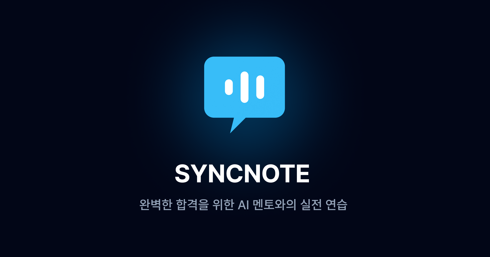
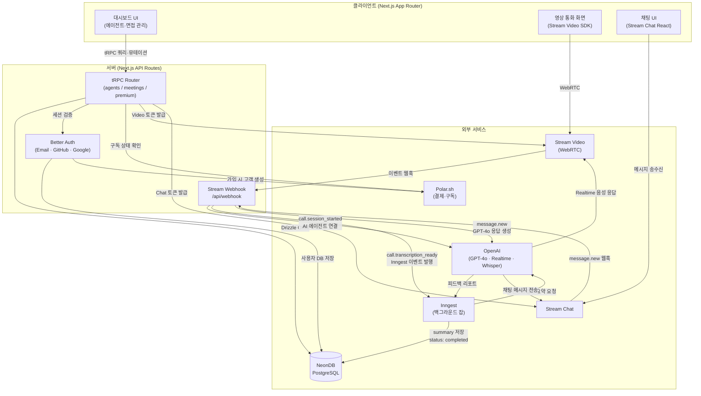
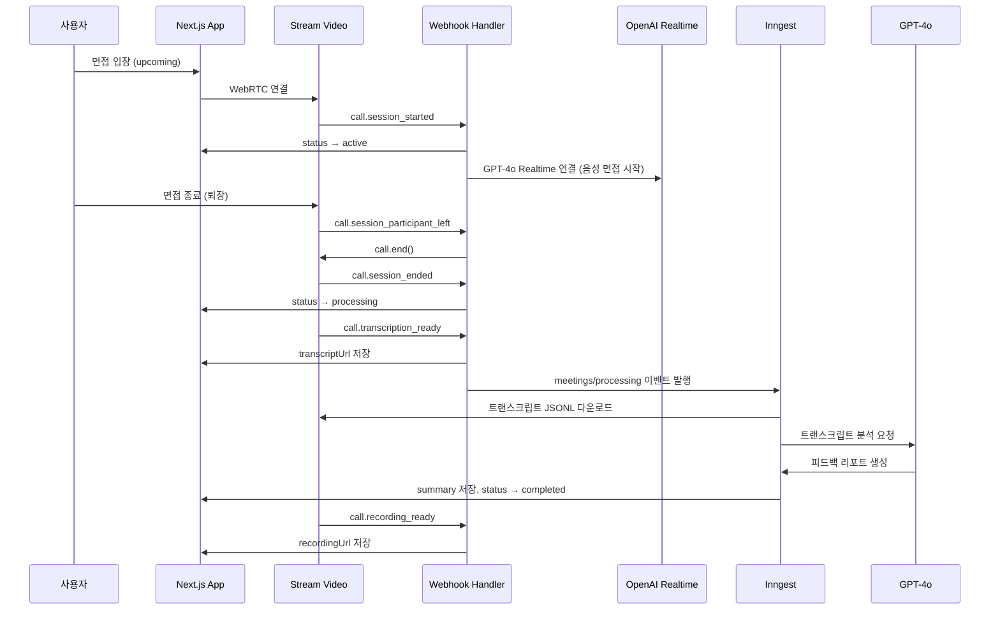

# SYNCNOTE

> 나만의 AI 면접관을 설계하고, 실시간 음성으로 모의 면접을 진행한 뒤 피드백을 받는 서비스

[](https://nextjs.org/)
[](https://www.typescriptlang.org/)
[](https://neon.tech/)
[](https://tailwindcss.com/)
[](https://vitest.dev/)
[](https://www.cypress.io/)



---

## 목차

1. [프로젝트 기획 배경](#프로젝트-기획-배경)
2. [프로젝트 정보](#프로젝트-정보)
3. [주요 기능](#주요-기능)
4. [기술 스택](#기술-스택)
5. [시스템 아키텍처](#시스템-아키텍처)
6. [면접 상태 흐름](#면접-상태-흐름)
7. [테스트 전략](#테스트-전략)
8. [트러블 슈팅](#트러블-슈팅)
9. [배운 것 / 아쉬운 점](#배운-것--아쉬운-점)
10. [프로젝트 구조](#프로젝트-구조)
11. [로컬 실행](#로컬-실행)

## 프로젝트 기획 배경

이직을 준비하며 CS 면접 스터디를 직접 운영했습니다.  
사전에 과목별 예상 질문을 공유하고, 스터디 당일에는 무작위로 질문을 뽑아 각자 발표한 뒤 서로 피드백을 주고받는 방식이었습니다.

이 과정에서 예측하기 어려웠던 변수는 **사람**이었습니다.

한 주 동안 열심히 준비해도 스터디 당일에 참석자가 갑자기 불참하면서  
발표 기회 자체가 사라지는 등 스터디가 흐지부지 끝나는 상황이 많았습니다.

이런 경험을 통해 문득 이런 생각이 들었습니다.

> _사람 없이도 효과적으로 면접 연습을 할 수 있지 않을까?_

텍스트 기반의 AI 챗봇으로는 실제 면접 현장에서 느끼는 긴장감이나 현장감을 충분히 경험할 수 없었고,  
무엇보다 말하기 훈련까지 대체하기엔 부족하다는 한계가 분명했습니다.

이런 문제의식을 바탕으로, 저는 **실전 면접처럼 음성으로 AI와 대화**하면서 면접을 연습하고,  
면접 종료 후에는 **전문적인 피드백**까지 AI로부터 받을 수 있는 면접 서비스를 기획하게 되었습니다.

## 프로젝트 정보

| 구분     | 내용                                                                                                                                                                                                                                                                                                                                                                               |
| -------- | ---------------------------------------------------------------------------------------------------------------------------------------------------------------------------------------------------------------------------------------------------------------------------------------------------------------------------------------------------------------------------------- |
| **기간** | 2026.03 ~ 진행 중                                                                                                                                                                                                                                                                                                                                                                  |
| **형태** | 개인 프로젝트                                                                                                                                                                                                                                                                                                                                                                      |
| **비고** | · 강의를 통해 전체적인 아키텍처와 비동기 이벤트 파이프라인의 뼈대를 학습 <br />· 이후 강의에서 다루지 않은 실서비스 레벨의 테스트 환경(Vitest, Cypress)을 직접 설계하여 도입 <br />· 면접 도메인에 맞춘 AI 튜닝 및 웹훅 중복 등 엣지 케이스를 주도적으로 해결 <br />· Next.js 15의 보안 취약점 이슈를 인지하고, Next.js 16 및 주요 최신 라이브러리 스펙으로 전체 코드 마이그레이션 |

## 주요 기능

- **AI 면접관 커스터마이징**
  - 직무, 기술 스택, 난이도, 면접 스타일 등 세부 지침을 입력해 나만의 AI 면접관 생성

- **실시간 음성 면접**
  - Stream Video(WebRTC) + GPT-4o Realtime API로 AI가 음성으로 면접 진행

- **AI 피드백 리포트**
  - 면접 종료 후 대화 기록을 백그라운드에서 분석하여, 총평·강점·보완점·Q&A 리뷰가 담긴 리포트 자동 생성

- **면접 후 AI 채팅**
  - 완료된 면접의 요약본을 컨텍스트로 활용하여, AI 면접관과 채팅으로 추가 피드백 대화

- **구독 플랜**
  - 무료(에이전트 1개·면접 1회) 및 프리미엄(무제한) 플랜 제공, Polar.sh 결제 연동

## 기술 스택

강의에서 사용된 스택을 기반으로 했습니다.

각 기술이 왜 이 조합으로 쓰이는지 짚어보며 따라갔고, 테스트 도구(Vitest, Cypress)는 실무적인 필요를 고려하여 직접 선정했습니다.

| 분류            | 기술                                 | 선정 이유                                                                          |
| --------------- | ------------------------------------ | ---------------------------------------------------------------------------------- |
| Framework       | Next.js 16 (App Router), React 19    | 서버 컴포넌트로 초기 데이터를 프리페칭하고, API Route와 UI를 단일 레포에서 관리    |
| API             | tRPC v11, TanStack Query v5          | 별도 API 스펙 없이 서버·클라이언트 타입을 공유, 런타임 타입 안전성 확보            |
| Database        | PostgreSQL (NeonDB), Drizzle ORM     | 엣지 환경에 친화적이고 Prisma 대비 경량, `db:push`로 빠른 스키마 반영              |
| Auth            | Better Auth                          | 이메일/비밀번호 인증 + GitHub·Google OAuth를 단일 라이브러리로 처리                |
| Video / Chat    | Stream Video SDK, Stream Chat        | 복잡한 WebRTC 인프라를 직접 구축하지 않고도 녹화·트랜스크립션·웹훅 파이프라인 활용 |
| AI / LLM        | GPT-4o, GPT-4o Realtime, Whisper     | Realtime API의 Server VAD로 실시간 음성 턴 감지, Whisper로 한국어 트랜스크립션     |
| Background Jobs | Inngest                              | 트랜스크립트 처리를 API 응답에서 분리해 타임아웃 위험 제거, 단계별 재시도 가능     |
| Payments        | Polar.sh                             | 구독 생성·웹훅·고객 관리를 단일 API로 처리                                         |
| Styling         | Tailwind CSS v4, shadcn/ui, Radix UI | 접근성이 보장된 headless 컴포넌트 위에 디자인 적용                                 |
| Testing         | Vitest + Testing Library, Cypress    | 테스트 레이어를 분리하고 CI에서 자동화 가능한 구조                                 |

## 시스템 아키텍처



## 면접 상태 흐름



## 테스트 전략

### 기준

테스트 피라미드 원칙을 바탕으로 레이어를 나눴습니다.  
단위 테스트는 앱 전반을 넓게 커버하고, E2E 테스트는 핵심 사용자 시나리오에 집중해 작성했습니다.

모킹은 최소화했습니다.  
지나친 모킹은 실제 환경과 동떨어진 테스트가 될 수 있기에, 실제 동작을 최대한 반영하는 방식을 채택했습니다.

또한, 이미 안정성이 검증된 서드파티 라이브러리에 대한 중복 테스트는 배제하고,  
직접 작성한 비즈니스 로직과 사용자 경험을 검증하는 데 집중했습니다.

### 단위 테스트

Vitest와 RTL을 활용해 UI와 비즈니스 로직의 관심사가 분리된 영역을 중점적으로 검증했습니다.

- 공용 UI 컴포넌트
- Custom Hooks
- Zod 스키마 유효성 검증
- 비즈니스 로직 유틸 함수

### E2E 테스트

Cypress를 이용해 실제 브라우저 환경에서 핵심 사용자 경험을 검증했습니다.

다음과 같은 시나리오를 중심으로 테스트를 설계했습니다.

| 시나리오       | 검증 내용                                                      |
| -------------- | -------------------------------------------------------------- |
| 회원가입       | 필드 유효성, 중복 이메일 차단, 가입 성공                       |
| 에이전트 CRUD  | 생성·수정·삭제 흐름 및 목록 반영                               |
| 면접 CRUD      | 생성·삭제 흐름                                                 |
| 면접 상태별 UI | `upcoming` → `active` → `processing` → `completed` 상태별 화면 |

## 트러블 슈팅

개발 과정에서 겪었던 문제와 그 해결 과정을 정리했습니다.

### 1. Next.js Hydration Error — `useSession()`의 SSR/CSR 불일치

**문제**
`DashboardUserButton` 컴포넌트가 서버에서는 세션 없이 렌더링되고, 클라이언트에서는 `authClient.useSession()`이 즉시 세션 데이터를 반환하면서 HTML 불일치로 Hydration Error 발생

**원인**
`better-auth`의 `useSession()`은 클라이언트 전용 훅이라, 서버 렌더링 결과와 클라이언트 첫 렌더링 결과가 달라 React가 트리 불일치를 감지

**해결**
`mounted` state를 추가해 클라이언트 마운트 이후에만 사용자 UI를 렌더링

```tsx
const [mounted, setMounted] = useState(false);
useEffect(() => setMounted(true), []);

if (!mounted || isPending || !data?.user) return null;
```

### 2. OpenAI Realtime VAD — AI가 답변 도중 끼어드는 문제

**문제**
Server VAD의 기본값(`silence_duration_ms: 500`)으로 설정하면,  
응답 중 잠깐 멈추거나 생각을 정리할 때마다 AI가 말을 중간에 끊고 턴을 가져가 면접의 흐름이 끊김

**원인**
500ms는 일상 대화 기준으로 설계된 값으로 면접처럼 사고 시간이 필요한 상황에서는 너무 민감하게 반응

**해결**
`silence_duration_ms`를 1000ms로 늘려, 답변을 마무리하거나 생각을 가다듬을 수 있는 여유를 제공

```ts
turn_detection: {
  type: "server_vad",
  threshold: 0.5,
  prefix_padding_ms: 300,
  silence_duration_ms: 1000, // 500 → 1000
},
```

### 3. Webhook 중복 처리 — AI 에이전트가 면접에 재진입하는 문제

**문제**
`call.session_started` 이벤트가 여러 번 수신되거나, 이미 `active` 상태인 면접에 AI가 재연결 시도

**원인**
DB에서 면접 상태를 조회할 때, `completed`·`processing`만 제외하고 있어 `active` 상태도 쿼리 결과에 포함됨

**해결**
`not(eq(meetings.status, "active"))` 조건 추가

```ts
.where(
  and(
    eq(meetings.id, meetingId),
    not(eq(meetings.status, "active")),
    not(eq(meetings.status, "completed")),
    not(eq(meetings.status, "processing")),
  ),
)
```

### 4. AI 채팅 컨텍스트에 현재 메시지가 이중으로 포함되는 문제

**문제**
`message.new` 웹훅 수신 시 최근 5개 메시지를 컨텍스트로 전달하는데,  
방금 입력해서 웹훅을 트리거한 메시지 자체도 `channel.state.messages`에 포함되어 중복 전달됨

**해결**
이벤트 객체에서 `currentMessageId`를 캡처한 뒤, 이전 메시지 배열을 필터링하는 단계에서 현재 메시지를 제외하도록 처리

```ts
const currentMessageId = event.message?.id;

const previousMessages = channel.state.messages
  .filter((msg) => msg.id !== currentMessageId && msg.text?.trim() !== "")
  .slice(-5);
```

## 배운 것 / 아쉬운 점

### 배운 것

이번 프로젝트를 통해 처음 접해보는 기술들을 깊이 있게 다뤄볼 수 있었습니다.

- **서버리스 환경 구축**
  - NeonDB, Inngest 같은 서버리스 기반 인프라를 연동하고 운영하는 방식

- **테스트 코드 작성**
  - 단위·통합·E2E 레이어를 나누는 기준, 모킹을 최소화하는 이유, 테스트 피라미드의 실제 적용

- **웹훅 기반 비동기 처리**
  - Stream 웹훅 → Inngest → DB로 이어지는 비동기 이벤트 흐름 설계

- **관심사 분리**
  - tRPC 미들웨어로 비즈니스 로직과 규칙을 캡슐화하고, 서버 컴포넌트와 클라이언트 컴포넌트의 역할을 나누는 방식

### 아쉬운 점

초기 아키텍처 설계와 백그라운드 이벤트 파이프라인 구축을 강의 자료에 의존해 시작했다는 점은 아쉬움으로 남습니다.

하지만 단순히 강의를 따라 하기보다는, 면접이라는 특수한 도메인에 맞게 AI의 응답 속도(VAD)를 세밀하게 조율하고,  
강의에서 다루지 않은 단위/E2E 테스트 환경을 직접 구축해 서비스의 안정성을 실서비스 수준으로 끌어올리기 위해 깊이 고민하고 해결했습니다.

이번 경험을 발판 삼아 다음 프로젝트는 초기 기획 단계부터 시스템 설계, 구현, 운영까지 온전히 직접 주도하여 진행해 볼 계획입니다.

## 프로젝트 구조

```
src/
├── app/
│   ├── (auth)/              # 로그인·회원가입 레이아웃
│   ├── (dashboard)/         # 대시보드 (에이전트·면접 목록/상세·업그레이드)
│   ├── call/[meetingId]/    # 영상 통화 화면
│   └── api/
│       ├── auth/            # Better Auth 핸들러
│       ├── inngest/         # Inngest 함수 엔드포인트
│       ├── trpc/            # tRPC HTTP 핸들러
│       └── webhook/         # Stream 웹훅 핸들러
├── components/              # 공용 UI 컴포넌트 (단위 테스트 포함)
├── db/                      # Drizzle 스키마 및 DB 클라이언트
├── inngest/                 # 백그라운드 잡 (AI 피드백 파이프라인)
├── modules/
│   ├── agents/              # 에이전트 CRUD (tRPC router · hooks · UI)
│   ├── auth/                # 인증 뷰 및 스키마
│   ├── call/                # 통화 UI (Provider·Lobby·Active·Ended)
│   ├── dashboard/           # 사이드바·네브바·커맨드 팔레트
│   ├── meetings/            # 면접 CRUD + 상태별 UI (단위·E2E 테스트 포함)
│   └── premium/             # 구독 플랜 UI 및 결제 연동
└── trpc/                    # tRPC 설정·미들웨어·라우터
```

## 로컬 실행

### 환경 변수 설정

```bash
cp .env.example .env.local
```

```env
# Next
NEXT_PUBLIC_APP_URL=

# Database
DATABASE_URL=

# Auth
BETTER_AUTH_SECRET=
BETTER_AUTH_URL=

# OAuth
GITHUB_CLIENT_ID=
GITHUB_CLIENT_SECRET=
GOOGLE_CLIENT_ID=
GOOGLE_CLIENT_SECRET=

# Stream
NEXT_PUBLIC_STREAM_VIDEO_API_KEY=
STREAM_VIDEO_SECRET_KEY=
NEXT_PUBLIC_STREAM_CHAT_API_KEY=
STREAM_CHAT_SECRET_KEY=

# OpenAI
OPENAI_API_KEY=

# Polar.sh
POLAR_ACCESS_TOKEN=
```

### 실행

```bash
npm install
npm run db:push        # DB 스키마 적용
npm run dev            # 개발 서버 (http://localhost:3000)
npm run dev:webhook    # Stream 웹훅 수신용 ngrok 터널
```

### 테스트

```bash
npm run test           # 단위 테스트 (watch)
npm run test:run       # 단위 테스트 (1회)
npm run coverage       # 커버리지 리포트
npm run e2e            # E2E 테스트 (UI 모드)
npm run e2e:ci         # E2E 테스트 (headless)
```
